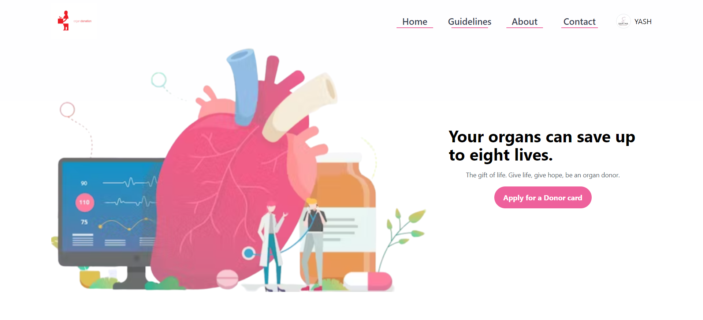
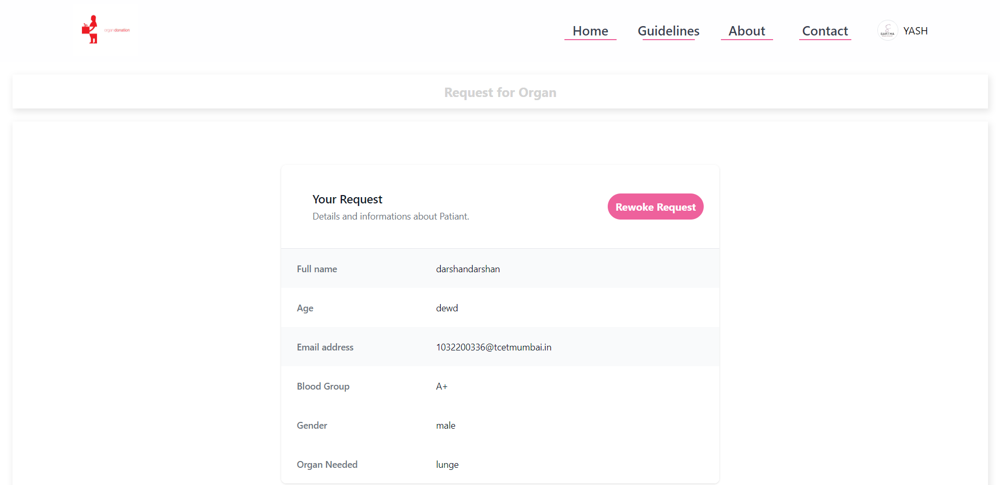
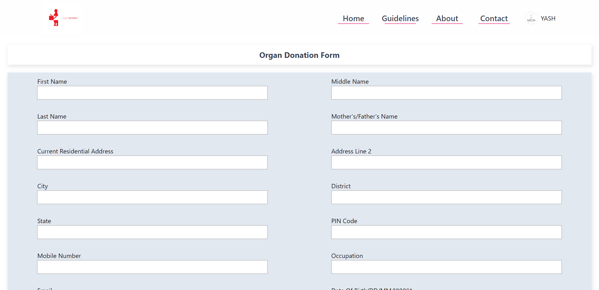
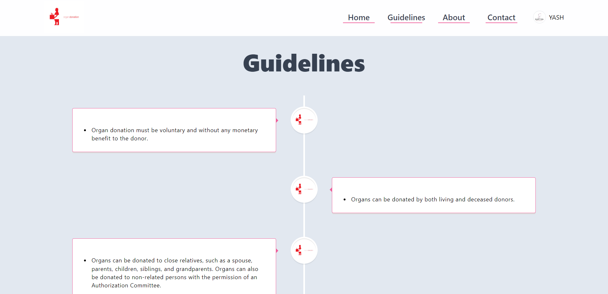
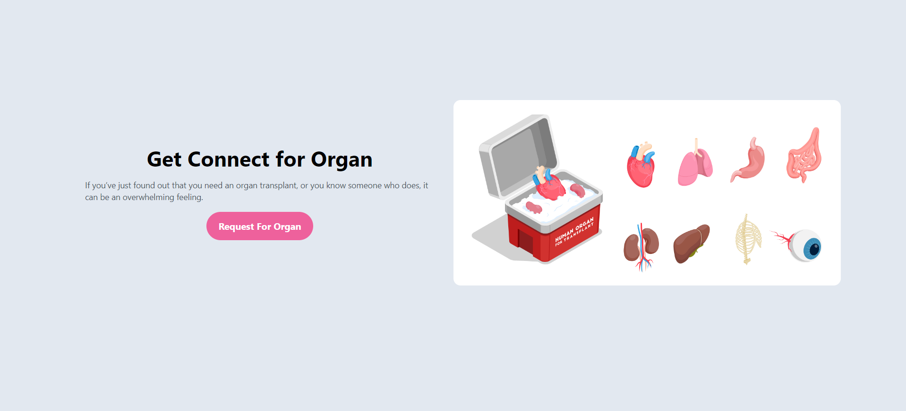

# Organ Donation React Project

This project is a web application built using React and Firebase to facilitate organ donation. It allows donors to join the platform, receive a donor card, and enables recipients to request organs. If a match is found between a donor and recipient, the recipient will be informed.

## images

     

## Table of Contents

- [Features](#features)
- [Prerequisites](#prerequisites)
- [Getting Started](#getting-started)
- [Project Structure](#project-structure)
- [Technologies Used](#technologies-used)
- [Contributing](#contributing)
- [License](#license)

## Features

- **Donor Registration:** Donors can register on the platform, providing their details and organ compatibility.

- **Donor Card:** Donors receive a digital donor card after registration.

- **Recipient Requests:** Recipients can submit organ requests, specifying their needs.

- **Matching Algorithm:** The platform uses an algorithm to match donors with compatible recipients.

- **Notifications:** When a match is found, recipients receive notifications.

## Prerequisites

Before you begin, ensure you have met the following requirements:

- Node.js installed on your machine. You can download it from [nodejs.org](https://nodejs.org/).

- A Firebase project set up. Create a Firebase project on the [Firebase Console](https://console.firebase.google.com/).

- Firebase CLI installed globally: `npm install -g firebase-tools`.

## Getting Started

1. Clone the repository:

   ```bash
   git clone <repository-url>
   cd organ-donation-react
   ```
